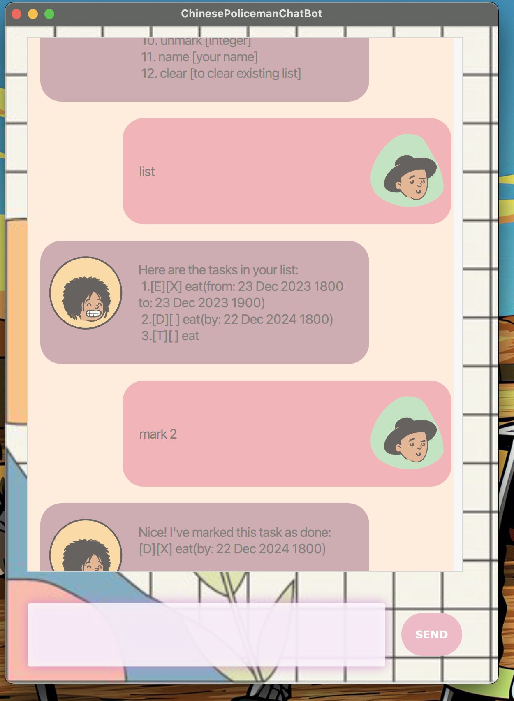

# Guide To ChinesePoliceMan

## Marvel in its Beauty

> [NOTE]
>
> Pay attention to the command format in the intro Messages otherwise
> bot may function unexpectedly.

## Command Guide

### Exiting the App:
#### *bye*

#### Example Inputs:
- `bye`
  Exits the app.

### Creating a Deadline:
#### *deadline [task description] /by [end date]*

Adds a deadline task with the task description and the date to complete by

#### Example Inputs:
- `deadline eat food /by 20/03/2024 1800`
- `deadline study /by 20/12/2024 0000`
>[WARNING]
>
> You need to have the exact dd/mm/yyyy HHmm format for deadline to be saved

### Creating an Event:
#### *event [task description] /from [start date] /to [end date]*

Adds an event task with the task description and the date to commence and the date when the event ends.

#### Example Inputs:
- `event eat food /from 20/03/2024 1800 /to 20/03/2024 1900`
- `event study /by 20/12/2024 0000 /to 21/12/2024 0000`
>[WARNING]
>
> - You need to have the exact dd/mm/yyyy HHmm format for deadline to be saved
> - The end date will have to be after start date otherwise ChinesePoliceman is gonna scold you

### Creating a todo:
#### *todo [task description]*

Adds a todo task with task description with no designated end times

#### Example Inputs:
- `todo eat food`
- `todo study`
>[WARNING]
>
> - While todo will still work if you add a date to it, we strongly advise you to use a deadline or event if there is a timing to meet

### Find all related task with the date:
#### *date [date to find]*

Searches through all current task and displays the list of related task with the inputted date

#### Example Inputs:
- `date 20/12/2024 0000`
- `date 20/12/2024 0000`
>[WARNING]
>
> You need to have the exact dd/mm/yyyy HHmm format for the date command to execute

### Mark Task as DONE:
#### *mark [index]*

Marks the task with the given index on the list as done

#### Example Inputs:
- `mark 1`
- `mark 2`
>[WARNING]
>
>We advise you look at the list before using mark to ensure that the index keyed in is valid

### UnMark Task as DONE:
#### *unmark [index]*

UnMarks the task with the given index on the list as done

#### Example Inputs:
- `unmark 1`
- `unmark 2`
>[WARNING]
>
>We advise you look at the list before using unmark to ensure that the index keyed in is valid

### Delete task from current list of task:
#### *delete [index]*

removes the task at the given index from the list

#### Example Inputs:
- `delete 1`
- `delete 2`
>[WARNING]
>
>We advise you look at the list before using delete to ensure that the index keyed in is valid

### Look for task with the specified task description:
#### *find [task description]*
Searches through the current list of tasks to find task with the matching task description

#### Example Inputs:
- `find eat`
- `find study `
>[WARNING]
>
>Returns an empty list if there no matching task

### Look at current list:
#### *list*

Marks the task with the given index on the list as done

#### Example Inputs:
- `list`

### Empty List
#### *clear*

Empties the current list of task

#### Example Inputs:
- `clear`
>[WARNING]
>
>The command is irreversible so make sure it is what you want todo
